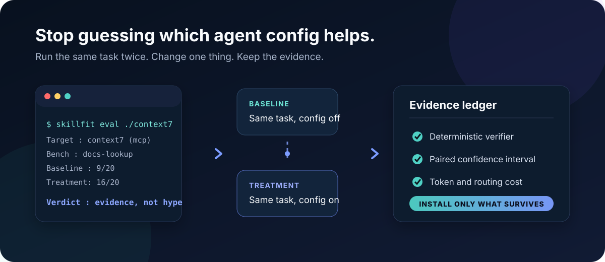

<div align="center">

# skillfit

**Skill registries tell you what's popular. skillfit tells you what actually works.**

Measure whether a skill, rules file, or MCP setup improves *your* agent on *your* tasks —<br/>
then install only what survives the experiment.

[](LICENSE)
[](package.json)
[](https://github.com/remote-controlled-man/skillfit/actions/workflows/ci.yml)
[](package.json)
[](https://github.com/remote-controlled-man/skillfit/stargazers)

[English](README.md) · [中文](README.zh-CN.md) · [日本語](README.ja.md) · [한국어](README.ko.md) · [Español](README.es.md)

[Quick start](#quick-start) · [Bench guide](benches/README.md) · [Metrics protocol](docs/metrics.md) · [Evidence](evidence/)

</div>

<p align="center">
  
</p>

---

## Why

The agent-config ecosystem has solved **distribution** (`npx skills add`, plugin marketplaces, MCP registries) but not **selection**. The evidence says unverified configuration can hurt:

- Curated skills improve pass rates by **+16.6pp** on average — but agent-self-generated skills score **−1.3pp**, and focused skills beat large bundles ([SkillsBench, arXiv:2602.12670](https://arxiv.org/abs/2602.12670))
- LLM-generated context files scored **−3%** while raising inference cost by 20%+ ([ETH Zurich, arXiv:2602.11988](https://arxiv.org/abs/2602.11988))
- 36% of scanned public skills contain prompt injection ([Snyk ToxicSkills, 2026-02](https://snyk.io/blog/toxicskills-malicious-ai-agent-skills-clawhub/))

skillfit is the missing measurement layer: paired A/B experiments with deterministic verifiers, statistical verdicts, and trigger-rate measurement — packaged as a CLI anyone can run.

## What you get

A real run, measuring whether an agent even *bothers to load* a skill when it is installed but not mentioned:

```console
$ node dist/cli.js eval ./skills/code-review --mode trigger --bench code-review --agent kimi-code

TASK        FIRE?  FIRED    UNKNOWN  ERRORS  PASS
review-r1   yes    1/3      0        0       3/3
review-r2   yes    0/3      0        0       3/3
review-r3   yes    0/3      0        0       3/3
explain-x1  no     0/3      0        0       3/3

Trigger recall      : 1/9 (11%) [95% CI 2%–44%]
False-trigger rate  : 0/3 (0%) [95% CI 0%–56%]
Precision           : 1/1 (100%) [95% CI 21%–100%]
F1                  : 0.20 (no CI: a harmonic mean of two proportions has no closed-form binomial interval)
```

The skill fired once in nine in-domain tasks — and the tasks pass 3/3 without it. That is a verdict no registry can give you.

<sub>Captured 2026-09-22 on Kimi Code against the four-task `code-review` bench. The bench has since gained a fifth task; the four metric lines above are re-rendered from that run's recorded per-task counts, so the run is real and the formatting is current.</sub>

## Quick start

```bash
git clone https://github.com/remote-controlled-man/skillfit.git
cd skillfit
npm ci
npm run build
node dist/cli.js --help
node dist/cli.js bench check benches/code-review
node dist/cli.js bench check benches/debugging
node dist/cli.js doctor
node dist/cli.js eval skills/skillfit --bench code-review --agent codex --dry-run
node dist/cli.js install --agent codex --dry-run
```

The bench checks are offline integrity checks, not agent-quality scores. `doctor` is read-only; the eval and install commands above only print plans. `codex` is an example agent ID; replace it with yours. A real eval needs your own Skill and bench plus a local agent CLI or API credentials. The setup commands below work in Bash and PowerShell; selecting upstream Skills needs network access, and only `--yes` installs them.

Supported agents: **Claude Code**, **OpenAI Codex CLI**, **Kimi Code** ([capability matrix](src/matrix/agents.json) — machine-readable, dated, doc-linked). Trigger-mode capture is currently verified for Kimi Code and Codex CLI.

## Test rules and MCP setups

Put a `skillfit-experiment.json` next to baseline and treatment project overlays. A rules experiment can add `AGENTS.md`; an MCP experiment can add `.codex/config.toml`, `.mcp.json`, or the path defined for another supported agent. skillfit copies the same task fixture into both arms, snapshots it for an identical prompt, then applies each overlay so the local agent discovers configuration through its normal loader.

```text
context7-experiment/
├── skillfit-experiment.json
├── baseline/.codex/config.toml
└── treatment/.codex/config.toml
```

```bash
node dist/cli.js eval ./context7-experiment --bench ./my-context7-bench --agent codex --trials 5 --dry-run
node dist/cli.js eval ./context7-experiment --bench ./my-context7-bench --agent codex --trials 5
```

Start with `skillfit mcp check` to verify the stdio handshake and tool catalog. It requests `tools/list` and audits names, descriptions, input schemas, and annotations without calling a tool. Then run the paired experiment to measure whether the model selects the server correctly and whether task outcomes improve. See [Rules and MCP experiments](docs/config-experiments.md).

For Codex MCP trials, skillfit passes a per-run trust override so the disposable project config loads without changing your Codex user config.

## Share an evaluation

Try the synthetic example below, then replace its path with the `Manifest:` path printed by your own paired `eval` run. The report includes provenance, uncertainty, errors, and warnings; it does not rerun the agent. See [sharing results](docs/sharing-results.md).

```bash
node dist/cli.js report eval docs/examples/eval-manifest.synthetic.json
```

## Selectable Codex setup

From a fresh clone, inspect the source catalog of 67 installable Skills with `--list`, then use repeated `--skill` flags to select only those relevant to your tasks. The seven retired local Skills are listed with reasons. `--starter` preserves the original 13-Skill selection, which has not been evaluated as a set; `--all` selects all 67 and is not a recommended default. The catalog checks sources and installation, not efficacy: only eight entries have limited historical paired tests, and none has proven benefit for the current pinned Skill versions and Codex model. The setup command fetches selected third-party Skills from pinned author commits, verifies SHA-256 hashes, and plans a managed global `AGENTS.md` block. The two locally authored Skills live in this repository. See the [selectable setup guide and evidence summary](docs/selectable-codex.md).

```bash
node dist/cli.js setup codex --list
node dist/cli.js setup codex --skill vibe-coding --skill diagnosing-bugs
node dist/cli.js setup codex --skill vibe-coding --skill diagnosing-bugs --yes
```

## Portable Codex setup

Export the user-level Skills seen in at least two Codex sessions and your active global guidance. Transfer the resulting directory to a new machine, then install it there. See [the portable setup guide](docs/portable-codex.md) for scope and options.

```bash
node dist/cli.js bundle export ./personal-codex --dry-run
node dist/cli.js bundle export ./personal-codex --yes
# transfer the personal-codex directory to the new machine
node ./personal-codex/setup.mjs --dry-run
node ./personal-codex/setup.mjs --yes
```

To export the full 65-Skill upstream source catalog, add `--upstream-lock ./profiles/codex-upstream-sources.json`. Setup then downloads those Skills from pinned author commits and verifies each file; locally authored Skills stay in the bundle. For a smaller new environment, use the selectable setup above. See the [source audit](docs/codex-upstream-audit.md).

## The eight commands

| Command | What it does | Writes? |
|---|---|---|
| `doctor` | Detects installed agents, checks rules bloat, skill validity/conflicts, MCP declaration presence and JSON syntax where supported, and silent-failure traps (e.g. AGENTS.md that Claude Code never reads) | Never |
| `report` | Skill usage receipts from retained local session history: fires per skill, candidates with no observed fire, and raw catalog size before agent-side limits. Absence is a prioritization signal, not proof of uselessness. It also renders an existing evaluation manifest as Markdown with `report eval`. | Never |
| `eval <target>` | Paired baseline/treatment runs for a Skill, rules overlay, or MCP overlay; deterministic verifier + optional blind LLM judge, token-cost delta, McNemar exact test, paired bootstrap CI, and graded facet-score CIs. `--mode trigger` installs a Skill and measures trigger recall / false-trigger rate from the agent transcript | `runs/` locally |
| `mcp check <spec>` | Starts a stdio MCP server, negotiates the protocol lifecycle, requests `tools/list`, and audits tool names, descriptions, input schemas, and annotations. Never calls a tool | Never |
| `bench` | `init` scaffolds a bench directory with a working example task; `check` validates a bench offline (verifier self-tests, oracle/NOP gates, mock-arm probes, fixture hygiene, trigger-label coverage); `add --freeze` turns a failure you just watched into a permanent bench task, and `--decompose` has an agent draft the verifier + oracle, admitted only if both gates pass | `init`/`add` after confirmation; `check` never |
| `install` | Managed-block rules (`<!-- SKILLFIT_START/END -->`, idempotent), skill copy with conflict protection, content-hash lockfile, post-install verification. Writes are staged first; if a write or verification fails, the installer rolls back changed target files, including the lockfile. Abrupt termination can still leave a partial install; re-run to reconcile. Your original is kept at `<file>.skillfit-bak` and the first backup wins, so later updates cannot overwrite it. `--dry-run` reports conflicts and exits 0; add `--strict` to make them fail (CI gates) | Only after confirmation |
| `setup codex` | Lists or installs a chosen set of pinned, verified upstream Skills and repository-owned Skills with global routing guidance; defaults to a dry run | Only with `--yes` |
| `bundle` | `export` creates a portable Codex profile from used local Skills and active global guidance | Only after confirmation |

## Bring your own bench

Evals are only as good as their tasks. A bench is just a directory — `bench.json` + fixtures + a deterministic verifier. Scaffold one with `node dist/cli.js bench init`, freeze a real failure you just watched your agent botch with `node dist/cli.js bench add <bench> --freeze`, validate offline with `node dist/cli.js bench check`, and model it on your own production scenarios: [benches/README.md](benches/README.md). If you have never written one, start with [docs/bench-authoring.md](docs/bench-authoring.md) — it walks the seven steps end to end on a single real task, and covers the ways a bench produces confident wrong numbers.

## Our own data

We ran skillfit's harness on 8 popular workflow skills (24 baseline/treatment pairs, Codex CLI, frozen 2026-07 baseline). One showed a limited regression-test artifact signal in 2/3 treated runs; no Skill showed a robust task-quality gain. These runs do not validate the current 67-Skill catalog or the legacy 13-Skill set:

| Skill | Quality Δ | Input tokens | Verdict |
|---|---:|---:|---|
| `diagnosing-bugs` | +66.7pp test-asset gain (2/3 runs); task quality unchanged | +11.7% | Limited historical process signal |
| `code-review` | +3.3pp (unstable) | +9.1% | Not enough evidence |
| `tdd` | 0.00pp | +9.2% | No measurable gain |
| `doubt-driven-development` | 0.00pp | +20.7% | No measurable gain |
| `security-and-hardening` | 0.00pp | +27.4% | No measurable gain, highest cost |
| 3 more | 0.00pp | +14.7~17.0% | No measurable gain |

Full methodology and raw manifests: [evidence/](evidence/). Reproduce it yourself with `skillfit eval`.

## Design principles

- **Standards, not formats.** AGENTS.md (AAIF), SKILL.md, `.agents/skills/`, `.mcpb` — we write what agents already read.
- **Deny by default.** We install only what a profile explicitly declares, pinned by content hash.
- **Dry-run first.** Every write command prints its plan before touching a file. Backups always.
- **Honest numbers.** Every claim links to a manifest with model version, target hash, date, and variance. Verdict semantics are frozen in [docs/metrics.md](docs/metrics.md): significance comes from an exact McNemar test over discordant pairs, deltas carry paired-bootstrap CIs, and underpowered runs are labeled *indicative*, never "effective".

## Disclaimer

Not affiliated with Anthropic, OpenAI, Moonshot AI, or any agent vendor. Evaluation results depend on model version, harness, and tasks — treat them as dated evidence, not eternal truth.

## Roadmap

[October 2026 delivery plan](docs/growth-roadmap-2026-10.md)

- [x] doctor / eval / install core loop
- [x] Paired A/B harness with blind judging
- [x] Statistical verdicts (McNemar exact + paired bootstrap CI, manifest v4)
- [x] Trigger-rate measurement (`--mode trigger`: recall / false-trigger rate with Wilson CIs)
- [x] Bench scaffolding (`bench init` + `bench check`), failure freezing (`--freeze`), git-history mining (`--from-commit`), difficulty calibration (`--calibrate`)
- [x] Rules and MCP workspace A/B experiments with identical prompts
- [x] Read-only stdio MCP handshake and tool-catalog audit
- [ ] Trigger capture for Claude Code (blocked: needs working auth)
- [ ] Community bench & evidence submissions (reproducible-config CI re-runs, not trust-me results)
- [ ] Cursor / Gemini CLI / OpenCode adapters
- [ ] Streamable HTTP and 2026 stateless MCP preflight
- [ ] Full installed-Skill-set routing competition

## Contributing

See [CONTRIBUTING.md](CONTRIBUTING.md). The highest-value contribution is a bench built from your real workflow. Release notes live in [CHANGELOG.md](CHANGELOG.md); security reports go to [SECURITY.md](SECURITY.md).

## License

[MIT](LICENSE)
